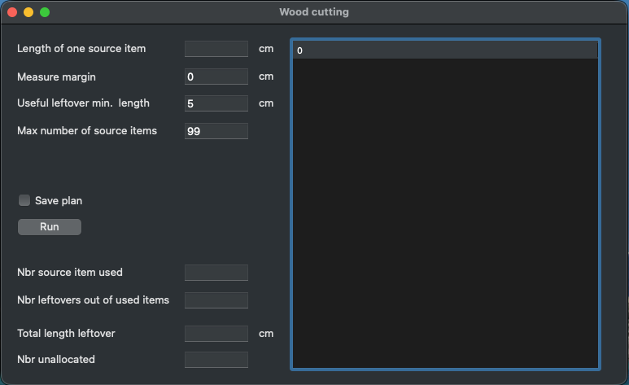
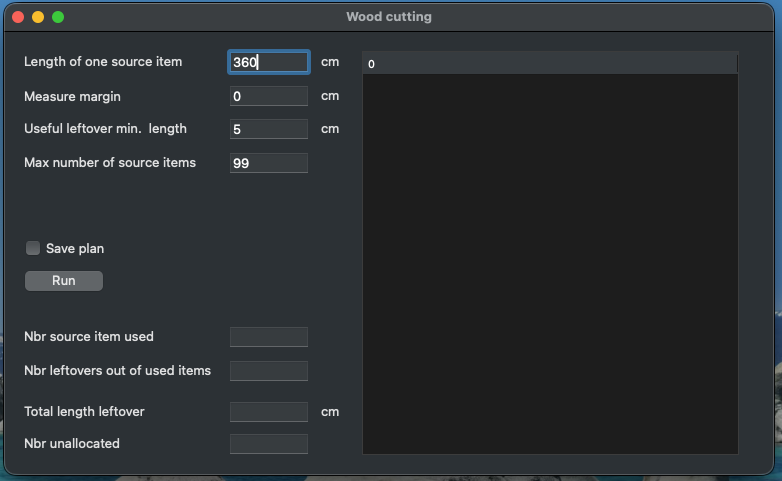
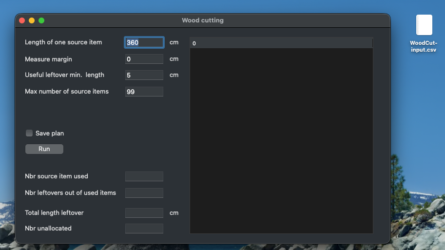
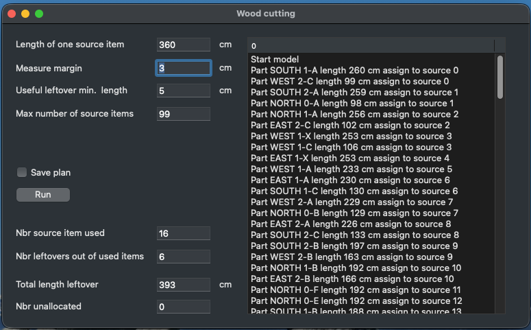
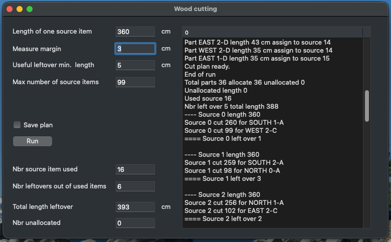
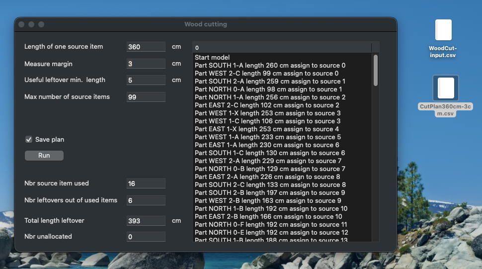
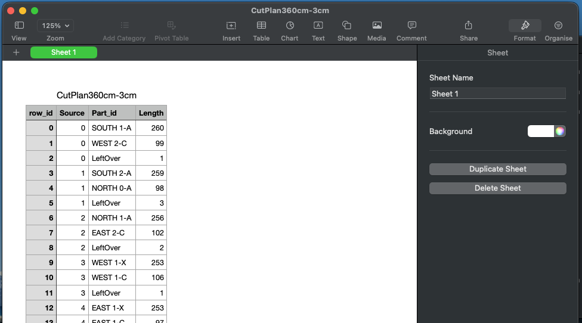

# sl-xj-WoodCutting

## Description

I created this (quick/dirty) project because I need to cut around 40 pieces of wood of different lengths out of standard pieces available at the nearby shop.

Did not want to waste to many wood and did not want to try to manually define a plan to cut the wood.

So, this model will 

- load a list of required items to cut
	- a label (expecting a string column named ‘Label’)
	- a length (expecting an integer column named ‘Value’)

- let the user define
	- the length of standard items (source item)
	- the measurement margin (a fixed value added to the loaded value to cover for errors)
	- the minimum length of a leftover to be considered for further cuts (useful leftover)
	- the maximum number of source items to use

#### Startup

	

#### Define the length of the items

	

#### Make sure the input file is on the desktop

	

 
- the model produces
	- a list of pieces (label and length) to cut out of each used standard wood
	- the number of source items used (I.e. what you need to buy)
	- the number of leftovers of which length is above the minimum length defined in input section (useful leftover)
	- the total length of the useful leftovers 
	- the number of required items not allocated either 
		- because the model ran out of source items or
		- because that source item is longer than the source items

The results can be saved as a .csv file, stored on the desktop.

#### Model run

	

#### Scroll down to get the results

	

#### If the user checks 'Save plan', an output file is created

	

	

This tool uses lib-data. The original version is available at https://github.com/slo1958/sl-xj-lib-data.git

# IMPORTANT

- To test, don’t forget to move the filer WoodCut-input.csv  to the desktop folder.

- Input file and output file management are very basic, the app will crash if the input file is not available in the desktop folder

- The input file is expected to contain: 
	- a column named ‘cell label’, that is renamed to ‘label’ when input file is loaded
	- a column named ‘cell value’ that is converted to integer, named ‘Value’ when input file is loaded

- The input file is loaded by method LoadRequirements

#### Example input file

	

Comments welcome.

